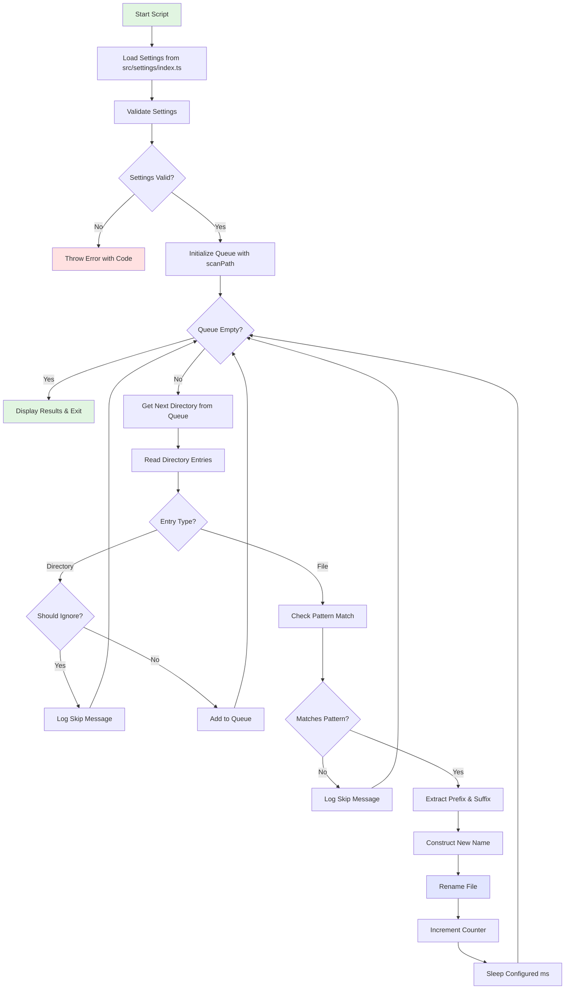

# Renamer

A powerful Node.js/TypeScript utility for bulk file renaming with pattern-based matching, comprehensive validation, and safe operation features.

Built with TypeScript for type safety and reliability, this tool helps automate the process of renaming multiple files that follow specific naming patterns.

## Features

- **Pattern-based Renaming**: Automatically rename files based on configurable naming patterns
- **Recursive Directory Scanning**: Process entire directory trees with subdirectory support
- **Comprehensive Validation**: Full settings validation with specific error messages and unique error codes
- **Flexible Configuration**: Customizable target names, separators, and replacement patterns
- **Safe Operation**: Built-in safeguards, detailed logging, and error resilience
- **Error Resilience**: Continues processing despite individual file failures
- **TypeScript**: Fully typed with comprehensive type definitions
- **Path Filtering**: Skip specific directories like `node_modules` and `.git`
- **Configurable Delays**: Prevent file system overload with adjustable delays between operations

## Getting Started

### Prerequisites

- Node.js (v18 or higher recommended)
- pnpm (recommended) or npm

### Installation

1. **Clone the repository**:

   ```bash
   git clone https://github.com/orassayag/renamer.git
   cd renamer
   ```

2. **Install dependencies**:

   ```bash
   pnpm install
   ```

3. **Build the project**:

   ```bash
   pnpm build
   ```

### Configuration

**Configure settings** in `src/settings/index.ts`:

   ```typescript
   export const SETTINGS: Settings = {
     targetNames: ['IMG', 'Screenshot'],
     replaceName: 'notes-',
     scanPath: 'C:\\Users\\Username\\Downloads',
     separator: '_',
     ignorePaths: ['node_modules', '.git'],
     sleepAfterMilliseconds: 50,
   };
   ```

### Running the Script

```bash
pnpm start
```

## How It Works



### Process Flow

The script renames files that match the pattern:

```
[targetName][separator][remainingFileName]
```

**Example**: Files like `IMG_photo1.jpg` become `notes-photo1.jpg`

### Before & After

```
Before:
├── IMG_photo1.jpg
├── Screenshot_2023.png
├── IMG_vacation.jpg
└── document.pdf

After (with targetNames: ["IMG", "Screenshot"], replaceName: "notes-"):
├── notes-photo1.jpg
├── notes-2023.png
├── notes-vacation.jpg
└── document.pdf (unchanged - doesn't match pattern)
```

## Configuration Options

| Parameter                | Type       | Description                  | Example                            |
| ------------------------ | ---------- | ---------------------------- | ---------------------------------- |
| `targetNames`            | `string[]` | File prefixes to match       | `["IMG", "Screenshot"]`            |
| `replaceName`            | `string`   | New prefix for renamed files | `"notes-"`                         |
| `scanPath`               | `string`   | Directory to scan            | `"C:\\Users\\Username\\Downloads"` |
| `separator`              | `string`   | Single character separator   | `"_"`                              |
| `ignorePaths`            | `string[]` | Directories to skip          | `["node_modules", ".git"]`         |
| `sleepAfterMilliseconds` | `number`   | Delay between operations     | `50`                               |

## Documentation

- **[INSTRUCTIONS.md](INSTRUCTIONS.md)**: Comprehensive usage guide, configuration details, and troubleshooting
- **[CONTRIBUTING.md](CONTRIBUTING.md)**: Guidelines for contributing to the project
- **Type Definitions**: Full TypeScript support with `src/types/settings.ts`
- **Code Documentation**: Inline JSDoc comments throughout the codebase

## Available Scripts

```bash
# Run the rename script
pnpm start

# Run in development mode with watch
pnpm dev

# Build the project
pnpm build

# Lint the codebase
pnpm lint
```

## Project Structure

```
src/
├── logic/
│   ├── processFile.ts          # Individual file processing logic
│   ├── scanAndRenameFiles.ts   # Directory scanning and recursion
│   └── validateSettings.ts     # Comprehensive settings validation
├── scripts/
│   └── renameScript.ts         # Main execution script
├── settings/
│   └── index.ts                # Configuration settings
├── types/
│   ├── settings.ts             # TypeScript type definitions
│   └── index.ts                # Type exports
└── utils/
    ├── shouldIgnorePath.ts     # Path filtering utilities
    ├── sleep.ts                # Async delay utility
    └── index.ts                # Utility exports
```

## Safety Features

- **Pre-execution Validation**: All settings validated before processing
- **Detailed Logging**: Comprehensive operation logs and error reporting
- **Error Resilience**: Continues processing despite individual file failures
- **Path Sanitization**: Prevents path traversal vulnerabilities
- **Configurable Delays**: Prevents file system overload

## Important Notes

- **Backup First**: Always backup important directories before bulk operations
- **Test Small**: Test with a small directory before processing large volumes
- **No Undo**: The script doesn't provide undo functionality - keep backups!
- **Pattern Matching**: Only processes files matching the exact naming pattern

## Troubleshooting

### Common Issues

1. **"Cannot access scanPath"**: Verify the directory exists and you have read permissions
2. **"No files renamed"**: Check that your target names and separators match existing files
3. **"Permission denied"**: Ensure you have write permissions in the target directory

### Error Messages

The script provides specific error messages for common issues:

- Invalid settings with detailed parameter validation
- File system access problems
- Type checking errors
- Path validation failures

## Error Codes

The script provides unique error codes (1000001-1000030) for all validation and runtime errors. Each error code follows the pattern `(1000XXX)` and appears at the end of error messages for easy troubleshooting and debugging.

## Development

The project uses:
- **TypeScript** for type safety and better developer experience
- **pnpm** for fast, efficient package management
- **ESLint** for code linting and quality checks
- **Prettier** for consistent code formatting
- **tsx** for running TypeScript directly without compilation

## License

MIT License - see [LICENSE](LICENSE) file for details.

## Author

**Or Assayag**
* Email: <orassayag@gmail.com>
* GitHub: [orassayag](https://github.com/orassayag)
* StackOverflow: [or-assayag](https://stackoverflow.com/users/4442606/or-assayag?tab=profile)
* LinkedIn: [orassayag](https://linkedin.com/in/orassayag)

## Contributing

Contributions to this project are [released](https://help.github.com/articles/github-terms-of-service/#6-contributions-under-repository-license) to the public under the [project's open source license](LICENSE).

Everyone is welcome to contribute. Contributing doesn't just mean submitting pull requests—there are many different ways to get involved, including answering questions, reporting issues, improving documentation, or suggesting new features.

Please feel free to contact me with any question, comment, pull-request, issue, or any other thing you have in mind. See [CONTRIBUTING.md](CONTRIBUTING.md) for detailed guidelines.

### Quick Contribution Steps

1. Fork the repository
2. Create your feature branch (`git checkout -b feature/AmazingFeature`)
3. Commit your changes (`git commit -m 'Add some AmazingFeature'`)
4. Push to the branch (`git push origin feature/AmazingFeature`)
5. Open a Pull Request

## Keywords

- `file` - File operations and management
- `files` - Multiple file processing
- `rename` - Bulk renaming functionality
- `bulk` - Batch processing capabilities
- `typescript` - TypeScript implementation
- `node` - Node.js runtime
- `pattern-matching` - Pattern-based file identification

---

**Fast, Safe, and Reliable Bulk File Renaming with TypeScript**
